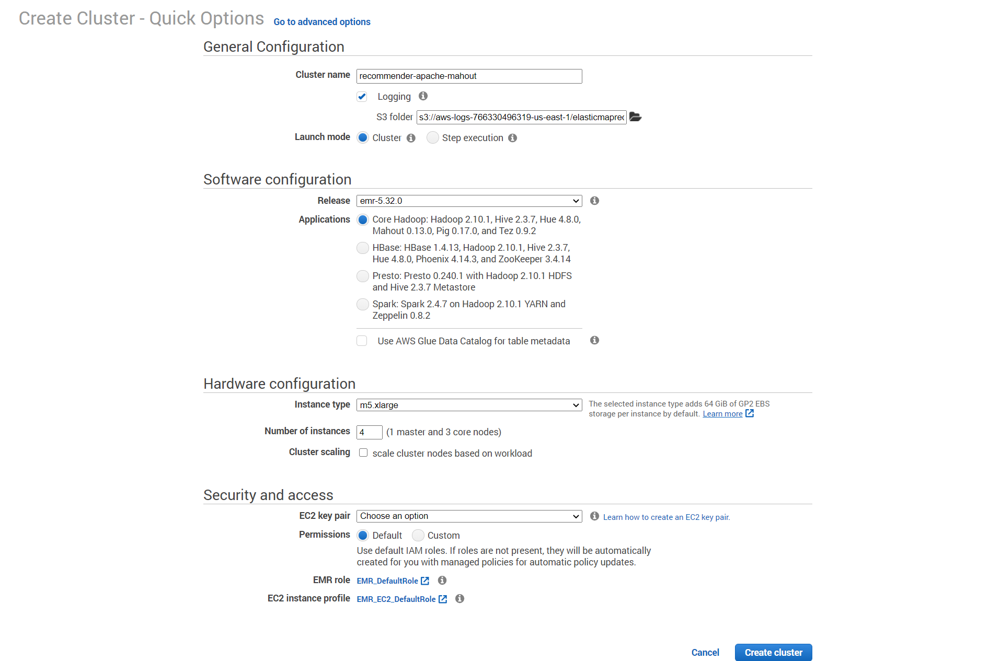
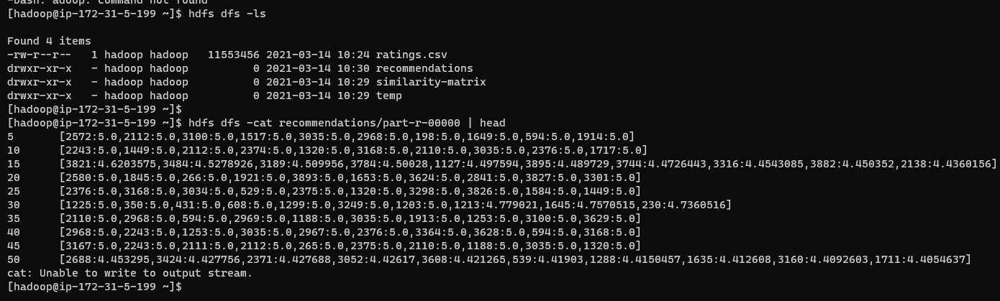
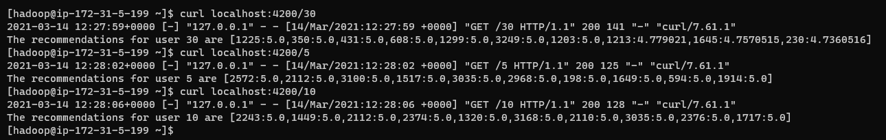

# Recommender with Apache Mahout on Amazon Elastic MapReduce (EMR)

source: [AWS Big Data Blog](https://aws.amazon.com/blogs/big-data/building-a-recommender-with-apache-mahout-on-amazon-elastic-mapreduce-emr/)   
Steps to build a simple movie recommender and to write and run a simple web service to provide results to client applications.  
This tutorial uses Ratings given to movie titles by users in the [MovieLens data set](http://grouplens.org/datasets/movielens/), which was compiled by the GroupLens team, and will use the `recommenditembased` example to find most-recommended movies for each user.

## Part 1 - Building a Recommender

1. Start up an EMR cluster with 4 nodes (1 master, 3 slave)

2. SSH into master node
> `ssh -i <key-pair>.pem hadoop@<master-public-DNS>`
3. Get the MovieLens data
> `wget http://files.grouplens.org/datasets/movielens/ml-1m.zip`  
> `unzip ml-1m.zip`
4. Convert ratings.dat, trade “::” for “,”, and take only the first three columns:
> `cat ml-1m/ratings.dat | sed 's/::/,/g' | cut -f1-3 -d, > ratings.csv`
5. Put ratings file into HDFS:
> `hdfs dfs -put ratings.csv /user/hadoop/ratings.csv`
6. Run the recommender job:
> `mahout recommenditembased --input /user/hadoop/ratings.csv --output recommendations --numRecommendations 10 --outputPathForSimilarityMatrix similarity-matrix --similarityClassname SIMILARITY_COSINE`
7. Look for the results in the part-files containing the recommendations:
> `hdfs dfs -ls /user/hadoop/recommendations`  
> `hdfs dfs -cat /user/hadoop/recommendations/part-r-00000 | head`  
> 
> 

## Part 2 - Building a Recommender Service

1. Get Twisted, and Klein and Redis modules for Python.
> `pip3 install --user twisted`  
> `pip3 install --user klein`  
> `pip3 install --user redis`  
2. Install Redis and start up the server.
> `wget http://download.redis.io/releases/redis-2.8.7.tar.gz`  
> `tar xzf redis-2.8.7.tar.gz`  
> `cd redis-2.8.7`  
> `make`  
> `./src/redis-server &`  
3. Build a web service that pulls the recommendations into Redis and responds to queries.  
Put the content in [scripts/server.py](./scripts/server.py) into a new python file `server.py`
4. Start the web service.
> `twistd -noy server.py &`
5. Test the web service with user id “5”:
> `curl localhost:4200/5`  
> 
> 

## Now you have a movie recommender service 

